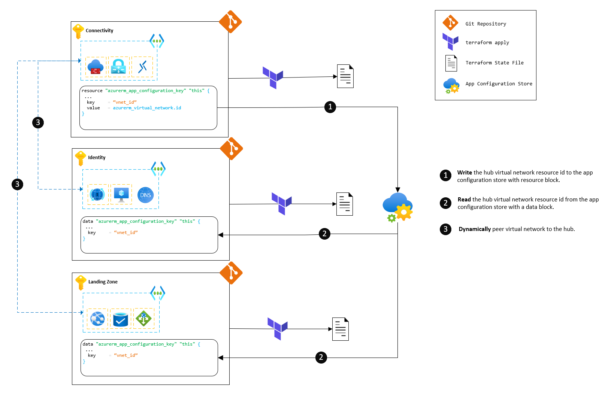

# Dynamically Sharing Configuration Across Multiple Terraform Deployments

In the realm of large enterprises, employing a monolithic Terraform setup becomes impractical. Dividing the infrastructure deployments into separate components not only reduces code complexity but also confines the blast radius of any change, as each component resides in its distinct Terraform state file. However, this segmentation introduces a new challenge: how can dependent configurations be dynamically shared among these deployments? Unlike in a monolithic deployment where resource attributes facilitate information exchange and dependency graph construction, this capability is lost when deployments are separated. This repository serves as a demonstration of effectively sharing configuration across different Terraform deployments.

## Table of Contents

1. [Scenario](#scenario)
   - [The Architecture](#the-architecture)
   - [The Code](#the-code)
   - [The Goal](#the-goal)
2. [High Level Solution Design](#high-level-solution-design)
3. [Design Decisions](#design-decisions)
   - [Azure App Configuration Store](#azure-app-configuration-store)
   - [Why Not Use The `terraform_remote_state` Data Source?](#why-not-use-the-terraform_remote_state-data-source)
   - [Separate Terraform Deployments](#separate-terraform-deployments)
4. [Deployment Instructions](#deployment-instructions)
   - [Prerequisite Tooling](#prerequisite-tooling)
   - [Automated Script](#automated-script)
   - [Pre-deployment](#pre-deployment)
   - [Hub Deployment](#hub-deployment)
   - [Spoke Deployment - Identity](#spoke-deployment-identity)
   - [Spoke Deployment - Landing Zone](#spoke-deployment-landing-zone)
   - [Post-deployment](#post-deployment)
5. [Clean Up](#clean-up)

## Scenario

### The Architecture

The scenario we aim to address involves a standard hub-and-spoke architecture. In this setup, the *hub* represents a centralized virtual network housing shared services like firewalls, Azure Bastion jumpboxes, and gateways to on-premises infrastructure. Conversely, the *spokes* are isolated virtual networks peered back to the hub, typically hosting application workloads. This architecture, a common pattern in Azure, is extensively documented in the [Azure Architecture Center](https://docs.microsoft.com/en-us/azure/architecture/reference-architectures/hybrid-networking/hub-spoke). While our specific case involves a hub and two spokes, the solution should seamlessly scale to accommodate any number of spokes.
> **Note:**<br>
In the diagram below, the *Identity* virtual network functions as a spoke, peered to the hub. Though it typically wouldn't host workloads, it's utilized for other shared services such as Domain Controllers and DNS.

### The Code

From an Infrastructure as Code (IaC) perspective, our objective is to deploy the hub and spoke architecture modularly. Each hub and spoke should be deployed separately using Terraform, resulting in three distinct state files.

### The Goal

Our aim is to dynamically share the hub virtual network's resource ID with the spoke deployments, enabling them to peer with the hub without resorting to hardcoding the hub virtual network resource ID in the spoke deployments.

## High Level Solution Design



As depicted, our solution leverages an Azure first-party service called App Configuration Store to serve as our central lightweight configuration database. This store facilitates both reading and writing operations, seamlessly integrated with Terraform via the `azurerm` provider. The hub virtual network's resource ID will reside in this configuration store, which the spoke deployments will read to establish peering with the hub.

## Design Decisions

### Azure App Configuration Store

We opt for Azure App Configuration Store as our central configuration database due to its lightweight nature, minimal maintenance requirements, and support for key-value pairs accessible from anywhere. Additionally, it boasts features like availability zones, geo-replication, private endpoints, and, crucially its  integration with Terraform via the `azurerm` provider.
> **Note:**<br>
A similar setup could be achieved using Azure Storage Table or equivalent services.

### Why Not Use The `terraform_remote_state` Data Source?

While the `terraform_remote_state` data source enables dynamic sharing of configuration between deployments by exposing root-level outputs, it necessitates full access to the state snapshot, posing potential security risks due to sensitive information exposure.

### Separate Terraform Deployments

As previously mentioned, dividing the infrastructure deployments into separate components reduces code complexity and mitigates the impact of changes by confining components to separate Terraform state files.

## Deployment Instructions

### Prerequisite Tooling

1. Azure CLI
2. Terraform
3. Azure Subscription where you have Owner permissions.

### 0. Automated Script

Though it is recommended to go through the manual steps to understand the process and the code, you can also run `. '.scripts\Deploy.ps1'` in the root directory to deploy the full multi-deployment infrastructure.

### 1. Pre-deployment

In this we will deploy the pre-requisites for the deployment of our hub and spoke architecture. This will include deploying the Azure App Configuration Store and also giving the necessary permissions to the principal doing the deployment to access the App Configuration Store, that is, the RBAC Role "App Configuration Data Owner". This used to perform data plane operations on the App Configuration Store such as reading and writing configuration key-values.

#### Resources

| Name | Type |
|------|------|
| [azurerm_app_configuration.this](https://registry.terraform.io/providers/hashicorp/azurerm/latest/docs/resources/app_configuration) | resource |
| [azurerm_resource_group.this](https://registry.terraform.io/providers/hashicorp/azurerm/latest/docs/resources/resource_group) | resource |
| [azurerm_role_assignment.this](https://registry.terraform.io/providers/hashicorp/azurerm/latest/docs/resources/role_assignment) | resource |
| [random_bytes.this](https://registry.terraform.io/providers/hashicorp/random/latest/docs/resources/bytes) | resource |
| [azurerm_client_config.current](https://registry.terraform.io/providers/hashicorp/azurerm/latest/docs/data-sources/client_config) | data source |

#### Steps

1. clone the repository:

```pwsh

git clone https://github.com/luke-taylor/terraform-shared-configuration
```

2. Change directory to the pre-deployment folder:

```pwsh
cd terraform-shared-configuration/pre-deployment
```

3. Authenticate to Azure using the Azure CLI:

```pwsh
az login
```

4. Initialize the Terraform configuration:

```pwsh
terraform init
```

5. Apply the Terraform configuration:

```pwsh
terraform apply -auto-approve
```

6. Set environment variable for `app_configuration_store_id` for the next deployments:

```pwsh
$env:APP_CONFIGURATION_STORE_ID = (terraform output app_configuration_store_id | convertFrom-Json)
```

7. Checkout root directory:

```pwsh
cd ..
```

### 2. Hub Deployment

The hub deployment will create the hub virtual network and some other optional resources like Azure Bastion and Azure Firewall which will be defaulted to disabled unless specified otherwise. The virtual network resource ID will be written to the Azure App Configuration Store through the `terraform-azurerm-app-configuration-read-write` module, this dynamically handles the JSON decoding and encoding of the values for us so we don't have to worry about it.

#### Modules

| Name | Source | Version |
|------|--------|---------|
| <a name="module_write_data"></a> [write\_data](#module\_write\_data) | ./../../modules/terraform-azurerm-app-configuration-read-write | n/a |

#### Resources

| Name | Type |
|------|------|
| [azurerm_bastion_host.this](https://registry.terraform.io/providers/hashicorp/azurerm/latest/docs/resources/bastion_host) | resource |
| [azurerm_firewall.this](https://registry.terraform.io/providers/hashicorp/azurerm/latest/docs/resources/firewall) | resource |
| [azurerm_public_ip.bastion](https://registry.terraform.io/providers/hashicorp/azurerm/latest/docs/resources/public_ip) | resource |
| [azurerm_public_ip.firewall](https://registry.terraform.io/providers/hashicorp/azurerm/latest/docs/resources/public_ip) | resource |
| [azurerm_resource_group.this](https://registry.terraform.io/providers/hashicorp/azurerm/latest/docs/resources/resource_group) | resource |
| [azurerm_virtual_network.this](https://registry.terraform.io/providers/hashicorp/azurerm/latest/docs/resources/virtual_network) | resource |

#### Inputs

| Name | Description | Type | Default | Required |
|------|-------------|------|---------|:--------:|
| <a name="input_app_configuration_store_id"></a> [app\_configuration\_store\_id](#input\_app\_configuration\_store\_id) | The name of the configuration store. | `string` | n/a | yes |
| <a name="input_bastion_enabled"></a> [bastion\_enabled](#input\_bastion\_enabled) | Whether to create the bastion. | `bool` | `false` | no |
| <a name="input_firewall_enabled"></a> [firewall\_enabled](#input\_firewall\_enabled) | Whether to create the firewall. | `bool` | `false` | no |

#### Steps

1. Change directory to the hub deployment folder:

```pwsh
cd deployments/hub
```

2. Initialize the Terraform configuration:

```pwsh
terraform init
```

3. Apply the Terraform configuration:

```pwsh
terraform apply -auto-approve
```

> **Note:**<br>
Ensure to set the `app_configuration_store_id` input variable to the value outputted from the pre-deployment step.

4. Change directory back to the root:

```pwsh
cd ..\..
```

### 3. Spoke Deployment - Identity

This deployment will create the spoke virtual network for the Identity resources, and we will peer this virtual network with the hub virtual network using the `terraform-azurerm-app-configuration-read-write` module to read the hub virtual network resource ID by simply specifying the key (`hub_vnet_id`) in the module inputs. We will also create a private DNS zone and link this back to the hub virtual network.

#### Modules

| Name | Source | Version |
|------|--------|---------|
| <a name="module_hub_virtual_network_id"></a> [hub\_virtual\_network\_id](#module\_hub\_virtual\_network\_id) | ./../../modules/terraform-azurerm-app-configuration-read-write | n/a |

#### Resources

| Name | Type |
|------|------|
| [azurerm_private_dns_zone.this](https://registry.terraform.io/providers/hashicorp/azurerm/latest/docs/resources/private_dns_zone) | resource |
| [azurerm_private_dns_zone_virtual_network_link.link_to_hub](https://registry.terraform.io/providers/hashicorp/azurerm/latest/docs/resources/private_dns_zone_virtual_network_link) | resource |
| [azurerm_private_dns_zone_virtual_network_link.link_to_identity](https://registry.terraform.io/providers/hashicorp/azurerm/latest/docs/resources/private_dns_zone_virtual_network_link) | resource |
| [azurerm_resource_group.this](https://registry.terraform.io/providers/hashicorp/azurerm/latest/docs/resources/resource_group) | resource |
| [azurerm_virtual_network.this](https://registry.terraform.io/providers/hashicorp/azurerm/latest/docs/resources/virtual_network) | resource |
| [azurerm_virtual_network_peering.hub_to_identity](https://registry.terraform.io/providers/hashicorp/azurerm/latest/docs/resources/virtual_network_peering) | resource |
| [azurerm_virtual_network_peering.identity_to_hub](https://registry.terraform.io/providers/hashicorp/azurerm/latest/docs/resources/virtual_network_peering) | resource |

#### Inputs

| Name | Description | Type | Default | Required |
|------|-------------|------|---------|:--------:|
| <a name="input_app_configuration_store_id"></a> [app\_configuration\_store\_id](#input\_app\_configuration\_store\_id) | The name of the configuration store. | `string` | n/a | yes |

#### Steps

1. Change directory to the identity deployment folder:

```pwsh
cd deployments/identity
```

2. Initialize the Terraform configuration:

```pwsh
terraform init
```

3. Apply the Terraform configuration:

```pwsh
terraform apply -auto-approve
```

> **Note:**<br>
Ensure to set the `app_configuration_store_id` input variable to the value outputted from the pre-deployment step.

4. Change directory back to the root:

```pwsh
cd ..\..
```

### 4. Spoke Deployment - Landing Zone

Finally, we will deploy the spoke virtual network for the Landing Zone resources, and we will peer this virtual network with the hub virtual network using the `terraform-azurerm-app-configuration-read-write` module to read the hub virtual network resource ID by simply specifying the key (`hub_vnet_id`) in the module inputs.

#### Modules

| Name | Source | Version |
|------|--------|---------|
| <a name="module_hub_virtual_network_id"></a> [hub\_virtual\_network\_id](#module\_hub\_virtual\_network\_id) | ./../../modules/terraform-azurerm-app-configuration-read-write | n/a |

#### Resources

| Name | Type |
|------|------|
| [azurerm_resource_group.this](https://registry.terraform.io/providers/hashicorp/azurerm/latest/docs/resources/resource_group) | resource |
| [azurerm_virtual_network.this](https://registry.terraform.io/providers/hashicorp/azurerm/latest/docs/resources/virtual_network) | resource |
| [azurerm_virtual_network_peering.hub_to_landing_zone](https://registry.terraform.io/providers/hashicorp/azurerm/latest/docs/resources/virtual_network_peering) | resource |
| [azurerm_virtual_network_peering.landing_zone_to_hub](https://registry.terraform.io/providers/hashicorp/azurerm/latest/docs/resources/virtual_network_peering) | resource |

#### Inputs

| Name | Description | Type | Default | Required |
|------|-------------|------|---------|:--------:|
| <a name="input_app_configuration_store_id"></a> [app\_configuration\_store\_id](#input\_app\_configuration\_store\_id) | The name of the configuration store. | `string` | n/a | yes |

#### Steps

1. Change directory to the identity deployment folder:

```pwsh
cd deployments/identity
```

2. Initialize the Terraform configuration:

```pwsh
terraform init
```

3. Apply the Terraform configuration:

```pwsh
terraform apply -auto-approve
```

> **Note:**<br>
Ensure to set the `app_configuration_store_id` input variable to the value outputted from the pre-deployment step.

4. Change directory back to the root:

```pwsh
cd ..\..
```

### 5. Post-deployment

Obsevere the deployed resources in the Azure Portal.


## Clean Up

To remove all resources efficiently run the following destroy script in the root directory:

```pwsh
 . '.scripts\Destroy.ps1'
```
